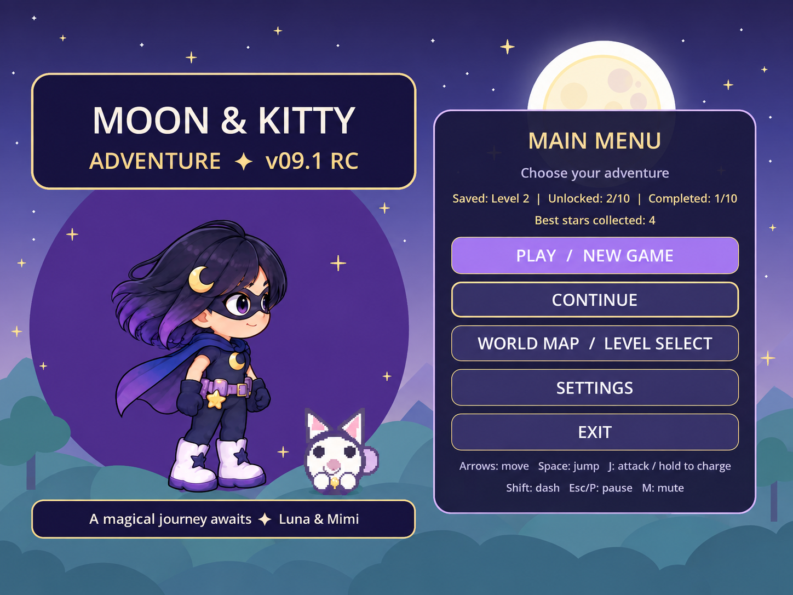
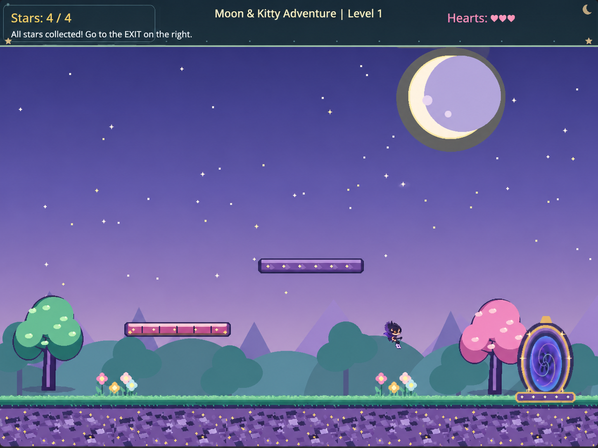

# Moon & Kitty Adventure 🌙🐱

A 2D fantasy platformer built with Godot and GDScript.

**Status:** In Development / Polishing

## About the Game

Moon & Kitty Adventure is a 2D fantasy platformer where players explore magical levels, collect stars, fight enemies, and reach the exit portal while progressing through the adventure.
## Screenshots

### Main Menu

### Gameplay — Level 1

### More Gameplay

## Features

- Character movement and jumping
- Attack and dash mechanics
- Collectible stars
- Enemy encounters
- Level progression
- Custom menus and UI
- Music and sound effects
- Fantasy 2D environments

## Built With

- Godot
- GDScript
- 2D Game Development
- Level Design
- UI Design
- Animation Integration
- Audio
- Debugging

## Portfolio

🌐 https://httpblog88.wordpress.com

## Developer

**Bouchra Bouidioua**  
Junior 2D Game Developer
